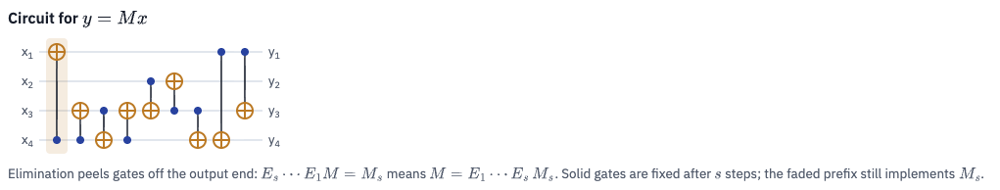

# 2026.09.26

This is the circuit panel at the **final step** of a path, with every gate drawn solid. It shows 9 CNOT gates that together compute $y = Mx \pmod 2$ for a $4\times4$ matrix $M$.

## How to read it

- **Wires.** The four horizontal lines carry the bits $x_1,\dots,x_4$ in on the left and $y_1,\dots,y_4$ out on the right. Time runs left to right.
- **One gate.** The blue dot is the **control** and the amber ⊕ is the **target**. A gate with its dot on $x_c$ and ⊕ on $x_t$ does
$$x_t \leftarrow x_t \oplus x_c,$$
  which is the same as the row operation $R_t \leftarrow R_t \oplus R_c$ on the matrix.
- **The highlighted gate** is the gate for the current elimination step.

## Why the order is reversed

Gaussian elimination and PMH do *not* build the circuit left to right. They reduce the matrix to the identity with row operations:
$$E_s \cdots E_1 M = M_s, \qquad E_k \cdots E_1 M = I.$$
Each CNOT is its own inverse, so
$$M = E_1 E_2 \cdots E_k.$$
Applied to $x$, the rightmost factor $E_k$ acts first. The **last** elimination step is therefore the **first** gate in the circuit.

That is why the caption says elimination "peels gates off the output end":

- At step $s$, the rightmost $s$ gates are fixed (drawn solid).
- The faded gates to their left still have to implement the leftover matrix $M_s$.

Here $s = k = 9$, so everything is solid. The highlighted leftmost gate was the final elimination step.

## Tracing the circuit

Start with inputs $(a,b,c,d)$ on wires $x_1..x_4$ and apply the gates in order. All sums are mod 2.

| Gate | Control → target | Effect |
|---|---|---|
| 1 | $x_4 \to x_1$ | $x_1 = a+d$ |
| 2 | $x_4 \to x_3$ | $x_3 = c+d$ |
| 3 | $x_3 \to x_4$ | $x_4 = c$ |
| 4 | $x_4 \to x_3$ | $x_3 = d$ |
| 5 | $x_2 \to x_3$ | $x_3 = b+d$ |
| 6 | $x_3 \to x_2$ | $x_2 = d$ |
| 7 | $x_3 \to x_4$ | $x_4 = b+c+d$ |
| 8 | $x_1 \to x_4$ | $x_4 = a+b+c$ |
| 9 | $x_1 \to x_3$ | $x_3 = a+b$ |

Reading off the outputs gives the matrix the circuit implements:
$$
y = \begin{pmatrix} a+d \\ d \\ a+b \\ a+b+c \end{pmatrix},
\qquad
M = \begin{pmatrix} 1&0&0&1\\ 0&0&0&1\\ 1&1&0&0\\ 1&1&1&0 \end{pmatrix}.
$$
The app runs this same check automatically; it is what the "circuit reproduces M ✓" badge means.

## A pattern worth noticing

Gates 2–4 alternate between the same two wires ($x_4\to x_3$, then $x_3\to x_4$, then $x_4\to x_3$). Three alternating CNOTs make a **SWAP**: after gate 4, $x_3 = d$ and $x_4 = c$.

So the heuristic spent 3 of its 9 gates just exchanging two wires. This kind of waste is exactly what a shortest-path search can remove. If this was the PMH path from earlier, the exact BFS optimum for that matrix was 6 gates, and the beam search found 6 as well.
